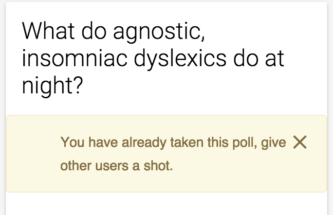

# roly_poly_pollster

Once there was a job application requiring a demo application to be written for poll creation and viewing of poll results, hence the birth of roly_poly_pollster.

## DB Relationship

## Couple of the design decisions made

The UI has no dependencies of an application server and can be fully served from the web server level.  For a quick turn around the application is structured using require.js and backbone.js. Templates are handled via the require.js text plugin along with lodash/underscore( _.template() ).

Since the polls can be running on a site that doesn't have an authenticated user in the session, a design decision was made to require all API calls to include a client [fingerprint](https://github.com/Valve/fingerprintjs2).  If a client doesn't provide their fingerprint the API returns a status code of 403 with no body payload.  The fingerprint is used as one characteristic for determining if the client has already taken the poll.

## Flow overview

When the user lands on the home page, they are presented with a list off all polls in the systems.  In order to take a poll or view a polls results you need to click on the button with text, "Poll Details(Take and view results)":

If you know the polls ID, you can navigate directly to the poll page using:

	/#poll/:id

To review poll results click the "VIEW RESULTS" button on the poll page:

To take the poll select one of the poll questions/answers from the poll page then click the SUBMIT button.  If no question/answer is selected a message is displayed informing the user to select a question.

If the user tries to take a poll which has already been taken they are provided a message:

To create a new poll, click on the "Create Poll" link from the menu bar.  When creating the poll some basic checks are enforced:

* The poll must have a name
* at least one question has to be asked

## Running the application

First ensure you have a postgres server running and you have a username/password for the connection.  Next after cloning this repo:

* npm install
* bower install
* copy knexfile.js.example to knexfile.js and specify the connection details for postgres.

Depending which environment you are running execute one or more:

* createdb poll_test
* createdb poll_development
* createdb poll_production

Now time to run the knex migrations:

*  export NODE_ENV=what ever env you want to migrate
*  ./node_modules/.bin/knex migrate:latest
*  node index.js
*  [access site - http://localhost:3000](http://localhost:3000)
